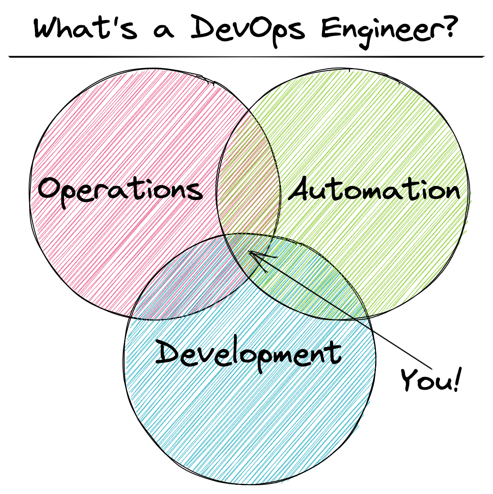
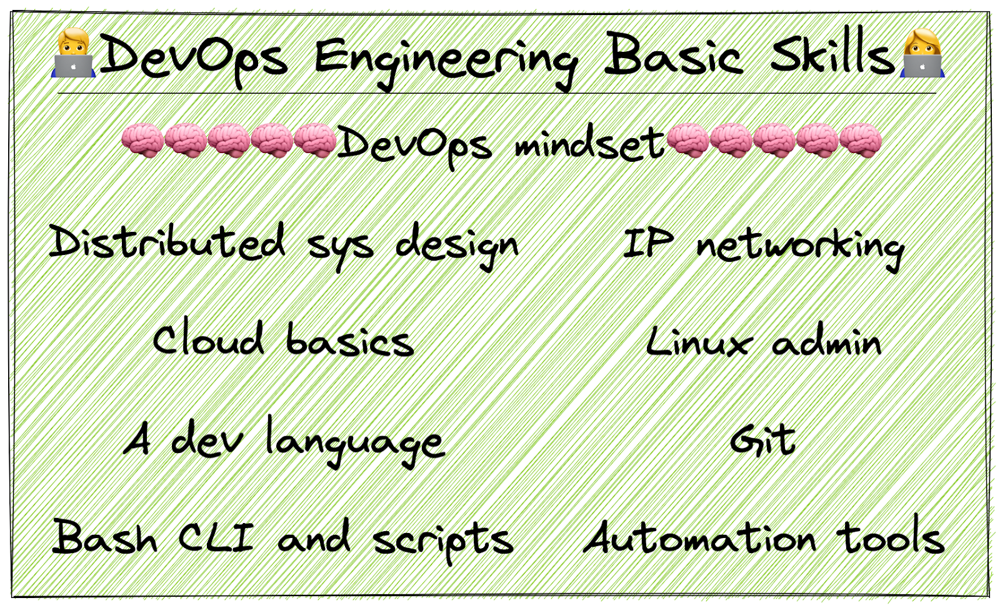

# learning-path
My DevOps & Site Reliability Engineering Learning Path

|  |  |
|:----------------------------------------------------------------:|:------------------------------------------------------------------------------:|

## Prerequisite
- [Programming Sucks](https://www.stilldrinking.org/programming-sucks)

## Introduction
### DevOps Engineer
- [Becoming a DevOps Engineer: Understanding the Role and Responsibilities](https://blog.udemy.com/devops-engineer/)
- [DevOps Roadmap](https://roadmap.sh/devops)

### Site Reliability Engineering / Site Reliability Engineer?
- [In Conversation](https://sre.google/in-conversation/)
  - In this interview, Ben Treynor Sloss shares his thoughts with Niall Murphy about what Site Reliability Engineering (SRE) is, how and why it works so well, and the factors that differentiate SRE from operations teams in industry.

## Site Reliability Engineering
### Basic / Beginner Skills 
- [School of SRE](https://linkedin.github.io/school-of-sre/)
### Google - Site Reliability Engineering
- [SRE Books](https://sre.google/books/)
  - Site Reliability Engineering
  - The Site Reliability Workbook
  - Building Secure and Reliable Systems

## Data Structures & Algorithms (Python)
### List, dictionary, stack, queue, deque, linked list, recursion, sorting, searching, trees, graphs.
- [Problem Solving with Algorithms and Data Structures using Python](https://runestone.academy/runestone/books/published/pythonds/index.html#)  
- [LeetCode (easy)](https://leetcode.com/problemset/all/?difficulty=Easy)

## Technical Interview Algorithms / Templates
- [Visualizing Four Key Technical Interview Algorithms](https://jeremyaguilon.me/blog/visualizing_four_key_interview_algorithms)  
  > An interactive way to learn four extremely crucial interview algorithms
- [A Collection of Whiteboard Interview Templates](https://jeremyaguilon.me/blog/a_collection_of_whiteboard_interview_templates)
  > Freeze up when transitioning from idea to implementation in code interviews? Use this guide to quickly get the skeleton down.

## Linux
- [Linux Journey](https://linuxjourney.com)
- [UNIX and Linux System Administration Handbook (5th Edition)](https://www.amazon.com/UNIX-Linux-System-Administration-Handbook/dp/0134277554) (Book)

## [The Missing Semester of Your CS Education](https://missing.csail.mit.edu)
A class that covers the shell, text editing, data wrangling, version control, remote/virtual machines, security, and more. 
> "Students are never shown how to use these tools, or at least not how to use them efficiently, and thus waste time and effort on tasks that should be simple. The standard CS curriculum is missing critical topics about the computing ecosystem that could make students’ lives significantly easier."
- [2020 Lectures](https://missing.csail.mit.edu/2020/)
  - [Course overview + the shell, Shell Tools and Scripting](), [Editors (Vim)](), [Data Wrangling](), [Command-line Environment](), [Version Control (Git)](), [Debugging and Profiling](), [Metaprogramming (build systems, dependency management, testing, CI)](), [Security and Cryptography](), [Potpourri](), [Q&A]()

## Infrastructure as Code (IaC)
> "Infrastructure as Code (IaC) is the approach of automating infrastructure deployment and changes by defining the desired resource states and their mutual relationships in code." - [Savic](https://www.digitalocean.com/community/users/savic)  

### Introduction to Infrastructure as Code
- [Infrastructure as Code: What Is It? Why Is It Important?](https://www.hashicorp.com/resources/what-is-infrastructure-as-code)  
- [Infrastructure as Code Explained](https://www.digitalocean.com/community/conceptual_articles/infrastructure-as-code-explained)  

### Terraform
- [Introduction to HashiCorp Terraform](https://www.hashicorp.com/resources/introduction-terraform-armon-dadgar-video)
- [A Comprehensive Guide to Terraform](https://blog.gruntwork.io/a-comprehensive-guide-to-terraform-b3d32832baca)

## Distributed Systems and System Design
- [MIT OpenCourseWare, MIT 6.824 Distributed Systems (Spring 2020)](https://www.youtube.com/playlist?list=PLrw6a1wE39_tb2fErI4-WkMbsvGQk9_UB) (Youtube Playlist)
- [Designing Data Intensive Applications](https://www.amazon.com/Designing-Data-Intensive-Applications-Reliable-Maintainable/dp/1449373321) (Book)

## System Design Interview
- [donnemartin / system-design-primer](https://github.com/donnemartin/system-design-primer)
- [checkcheckzz / system-design-interview](https://github.com/checkcheckzz/system-design-interview)
- [Gaurav Sen - System Design](https://www.youtube.com/playlist?list=PLMCXHnjXnTnvo6alSjVkgxV-VH6EPyvoX) (Youtube Playlist)

## Go
- [Effective Go](https://go.dev/doc/effective_go)
- [FREE coding exercises for budding gophers](https://gophercises.com)

## Security
- MIT OpenCourseWare, MIT 6.858 Computer Systems Security, Fall 2014
  - [Course Website](https://ocw.mit.edu/courses/electrical-engineering-and-computer-science/6-858-computer-systems-security-fall-2014/)
  - [Youtube Playlist](https://www.youtube.com/playlist?list=PLUl4u3cNGP62K2DjQLRxDNRi0z2IRWnNh)

## Engineering Blogs
- [kilimchoi/engineering-blogs](https://github.com/kilimchoi/engineering-blogs)
